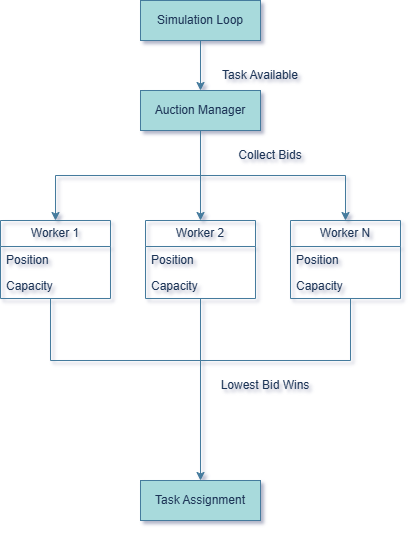
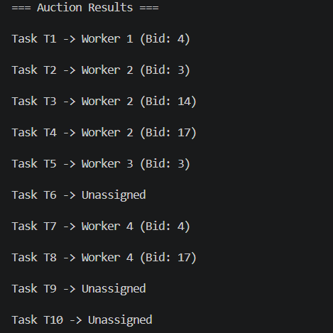
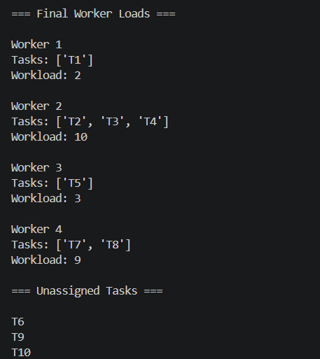

# Auction Task Allocation

A decentralized task allocation simulation where workers compete for tasks using a reverse auction mechanism.

## Features
- Reverse-auction based task allocation
- Dynamic bidding based on distance and current workload
- Capacity constraints
- Deadline feasibility checks
- Deterministic tie-breaking
- Handling of unassigned tasks

## System Architecture



This diagram illustrates the task allocation workflow. When a new task becomes available, the auction manager broadcasts it to all eligible workers. Each worker independently evaluates the task and submits a bid based on predefined criteria such as distance and current workload. The auction manager compares the bids and assigns the task to the worker with the lowest bid. 

## Project Structure
```
project/
|
├── auction/
|   ├── auctioneer.py
|   └── bidding.py
|
├── models/
|   ├── task.py
|   └── worker.py
|
├── screenshots/
|   ├── sample_output_1.png
|   └── sample_output_2.png
|
├── .gitignore
├── README.md
├── main.py
└── sample_data.py
```

## Component Overview

| Component | Responsibility |
|-----------|---------------|
| Worker | Autonomous agent responsible for evaluating tasks, submitting bids, and executing assigned tasks. |
| Task | Represents a unit of work containing task-related information used during allocation. |
| Bid | A value calculated by an eligible worker based on criteria such as distance and workload. |
| Auction Manager | Conducts the reverse auction by collecting bids and assigning the task to the worker with the lowest bid. |

## Execution Flow

1. Workers and tasks are initialized
2. Tasks are auctioned one at a time
3. Eligible workers calculate their bid
4. The auctioneer selects the lowest bid as the winner
5. The winning worker executes the task
6. This process repeats until all tasks have been processed

## Requirements

- Python 3.10+
- Standard Python library only (no exteral packages required)

## How to Run
```bash
python main.py
```

## Bidding Function

Each worker calculates a bid using:
```text
Bid = Distance + (Current Workload x Load Penalty)
```

The distance component of a worker's bid is calculated as the absolute difference between the worker's position and the task's position. A worker's workload is the sum of the complexities of all previously assigned tasks i.e the more complex tasks completed, the more workload a worker has. As a worker's workload increases, a load penalty raises future bids, making heavily loaded workers less likely to win additional tasks.

## Tie-Breaking Rule

If multiple workers submit the same lowest bid, then the worker with the lowest id is selected. This ensures deterministic and reproducible results.

## Design Decisions

- Workers move to the location of a completed task
- Task complexity contributes to a workers workload
- Tasks are auctioned sequentially
- Distance is calculated on a one-dimensional number line
- Deadlines represent the maximum travel distance a worker can cover to reach a task

## Configuration

The sample data can be adjusted in `sample_data.py`.

The following parameters can be adjusted:
- Number of workers
- Number of tasks
- Worker capacities
- Task deadlines
- Task locations
- Task complexities

## Sample Outputs

### Auction Results


### Final Worker Loads + Unassigned Tasks


## Future Enhancements

- Auction multiple tasks concurrently instead of sequentially
- Allow workers to drop previously assigned tasks when a more suitable task is available
- Have workers and tasks be placed on a two-dimensional grid instead of a number line